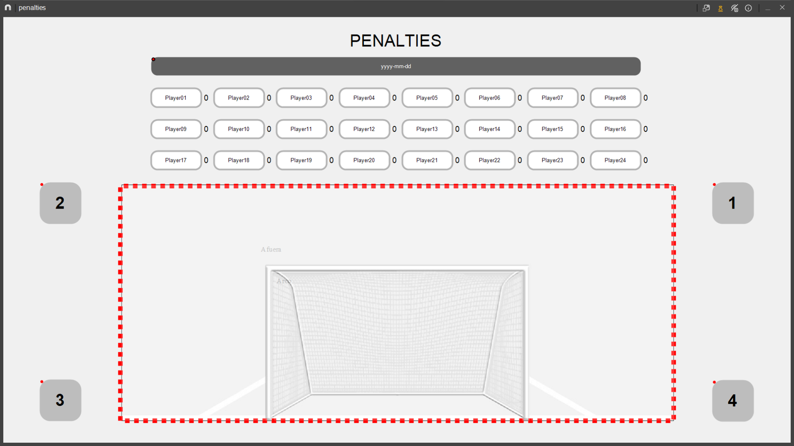

# Penalty analysis in football

## Introduction
This script arises from the study of the biomechanics of penalty kicks in blind soccer players. Currently, there is no standardized technique worldwide for approaching this type of kick. This opens up two aspects to consider. Firstly, corrections regarding execution tend to be as individualized as the technique itself. Secondly, the possibility of standardization remains open, as is common in developing sports techniques.

To even think about evaluating the technique, effectiveness must be defined. Two parameters are proposed for consideration: the accuracy and speed of the shot. For their measurement, the video recording of the event is projected, and [Kinovea](https://www.kinovea.org/) is used to determine speed and direction.

The human resources involved can be considered for the biomechanical analysis of the kicking gesture, leaving aside the weekly recording of effectiveness progression. Hence, the need for a method that fits the demanded daily routine arises.

The general concept of this script is to use coordinates $(x, y)$ in the shooting goal and the ball's flight time to determine the sought parameters. In particular, it is developed to be used in conjunction with [Nacsport](https://www.nacsport.com/) and its graphic descriptors.

Although the origin was in blind soccer, there is no distinction for any other soccer. Both the penalty spot distance and goal dimensions can be adjusted. Likewise, the proposed uncertainty calculation would still apply at such scales.

## Calculation

In the calculation, it is assumed that air resistance is negligible and the ball's trajectory is straight. The aim is to determine the average shot velocity and the distance to the center of the goal, considering this point as the one with the least difficulty for the goalkeeper. Additionally, the goal is divided into horizontal and vertical thirds to assess whether the shot reached the targeted area intended by the player.

### Distance ($d$)
The distance from the penalty spot to the entry point into the goal is calculated by neglecting the ball's parabola, assuming it travels in a straight line. The coordinate origin is defined at the point of execution. The goal plane is determined by the $x$ and $y$ axes. Therefore, the length ($L$) connecting the penalty spot and the center of the goal at ground level will be on the $Z$ axis. The value of $L$ will remain constant since it is a given length when kicking always from the same spot. Thus, $d$ is defined as:

$$
d = \sqrt{x^2 + y^2 + L^2}
$$

The error in $d$ is given by its components. The uncertainty of the coordinate $(x, y)$ is an input value in the script. However, a preliminary assessment would relate it to the ball's radius ($r$). Assigning a specific coordinate to an object with volume is subject to identifying its center. Thus, initially, $\delta x = \delta y = \pm r/2$ is proposed.

Regarding the distance $L$, it is considered that the uncertainty goes beyond the measurement instrument's precision error. This could be $\pm 0.001m$ in the case of a tape measure.

This consideration arises from the fact that the ball's initial and final positions are, at least, subject to the thickness ($\lambda$) of the demarcation lines. This is why an uncertainty of $\delta L = \pm \lambda/2$ is proposed. It is still a variable that can be entered into the script.

Assuming that,

$$
\delta f \approx \left| \frac{\partial f}{\partial x} \cdot \delta x \right| + \left| \frac{\partial f}{\partial y} \cdot \delta y \right| + \left| \frac{\partial f}{\partial z} \cdot \delta z \right|
$$

The error in the distance $d$ is given by,

$$
\delta d = \left| \frac{\partial d}{\partial x} \cdot \delta x \right| + \left| \frac{\partial d}{\partial y} \cdot \delta y \right| + \left| \frac{\partial d}{\partial z} \cdot \delta L \right|
$$

### Time ($t$)
Time is calculated based on the difference between the timestamp of the frame of the ball's final position and the initial position. The error is given by the fraction of seconds each frame represents, i.e.,

$$\delta t = \pm \frac{1}{fps}$$

### Velocity ($v$)

Velocity is the ratio between the distance ($d$) and time ($t$) calculated. Its uncertainty is given by,

$$\delta v = \left| \frac{1}{t} \cdot \delta d \right| + \left| -\frac{d}{t^2} \cdot \delta t \right|$$

### Accuracy ($R$)

The accuracy of the shot is the distance from its pair $(x;y)$ to the center of the goal. The greater the modulus, the better the shot, always considering the limits of the goalposts. Its value is obtained by,

$$
R = \sqrt{x^2 + y^2}
$$

With uncertainty,

$$
 \delta R = \left| \frac{\partial d}{\partial x} \cdot \delta x \right| + \left| \frac{\partial d}{\partial y} \cdot \delta y \right|
$$

On the other hand, before the shot, the player has a target he aims at, one of the four angles. This results in a lateral (left or right) hit and a height (low or high) hit. To determine this, the width and height of the goal are divided into thirds. Therefore, nine zones are determined, where four represent the angles. They are named, from the perspective of the shooter, numbered from right to left, counterclockwise:
* Zone 1: upper right
* Zone 2: upper left
* Zone 3: lower left
* Zone 4: lower right

A hit on the $x$ or $y$ axis is determined if the ball enters the corresponding third, thus leaving the central thirds out.

## Nacsport

For data recording, it is stipulated that the Nacsport template has each player as a manual category. Thus, when the ball impacts, the event begins, ending at the goal line. This will provide the corresponding Start and End times. Also, it will have a descriptor that will be automatically applied to each category with the execution date and a descriptor from 1 to 4 indicating the target zone of the shot. On the other hand, the graphical descriptor will mark the coordinate $(x; y)$, which will also have three zones marked according to the goal image:
* Goal
* Post
* Out

This will determine the result of the shot according to the assigned ordered pair.

